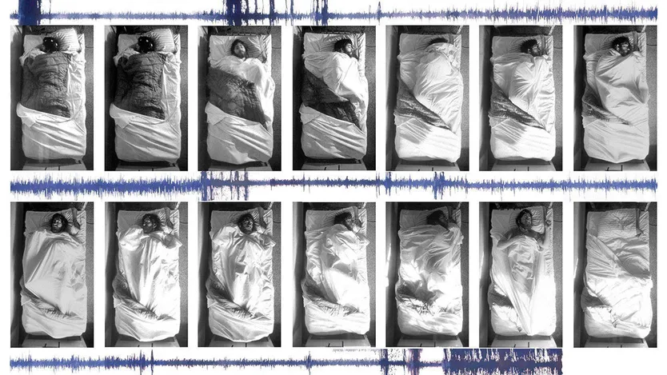

#A new book, “Mapping the Darkness”, explores the active world of sleep research

  

BIRDS DO IT. Bees do it. People do it, though often less than they would like to. Owls do it in the daytime. Even Caenorhabditis elegans/ˌsiːnoʊræbˈdaɪtəs ˈɛləɡæns/隐杆线虫, a primitive roundworm/ˈraʊnd.wɜːm/;蛔虫 made up of a few thousand cells, does something that looks an awful lot like it. Sleep is an ancient, universal experience.

But partly because it is so commonplace, for a long time sleep was a subject that scientists had not woken up to. It is only in the past half-century or so that it has attracted the attention of dedicated researchers. A new book from Kenneth Miller, a science journalist, sets out to chronicle/ˈkrɒnɪkl/编年史 the field’s short but fascinating history.

The book is organised around the life and hard work of four scientists. The patriarch/ˈpeɪ.tri.ɑːk/领军人物 of the field is Nathaniel Kleitman, whose presence/ˈprez.əns/存在 looms largest. A Jewish man born in what is now Moldova/mɒlˈdəʊvə/摩尔多瓦, he emigrated to America in 1915, escaping Russian pogroms/ˈpɒɡrəm/ before setting up a pioneering开拓性的；先驱性的 sleep-research programme at the University of Chicago.
>_patriarch：the male head of a family or community（男性）家长，族长，酋长_
**pogroms**: _is a violent riot incited with the aim of massacring or expelling an ethnic or religious group, particularly Jews.[1] The term entered the English language from Russian to describe 19th- and 20th-century attacks on Jews in the Russian Empire (mostly within the Pale of Settlement). Similar attacks against Jews which also occurred at other times and places became known retrospectively as pogroms.[2] Sometimes the word is used to describe publicly sanctioned purgative attacks against non-Jewish groups. The characteristics of a pogrom vary widely, depending on the specific incident, at times leading to, or culminating in, massacres_

The early pages of the book, before there is much in the way of established science to describe, are the weakest这本书的前几页，在还没有太多已建立的科学内容可描述的情况下，是最薄弱的部分. A good deal of time is spent on biographical details and pen portraits/ˈpɔːtreɪt/ of the world through which Kleitman moved. But the story soon picks up. It roams from the discovery of rapid-eye-movement (REM) sleep and circadian rhythms—the biological clocks that govern humanity’s days—to the effects of sleep deprivation (which can be fatal, at least in lab animals). It also probes the purpose, if any, of dreams.
>portraits/ˈpɔːtreɪt/
>1. a painting, drawing or photograph of a person, especially of the head and shoulders肖像；半身画像；半身照
>2. a detailed description of somebody/something详细的描述；描绘
>3.(used especially before another noun) the way of printing a document in which the top of the page is one of the shorter sides竖向的；纵向打印格式的

Underlying it all is a sense of psychology’s slow maturing as a science. New technologies such as electroencephalographs, which monitor electrical activity in the brain, have offered practitioners the ability to study brains directly, rather than trying to infer what they are doing from the behaviour of their owners.

Mr Miller has a good eye for a great scientific story. One of Kleitman’s best-known experiments involved spending 32 days in a dark cave as he worked to shed light on the limits of the body’s inbuilt circadian clock. The author is happy to show research as it is really done, indignities and all.

One section describes a more modern, quantitative sort of circadian-rhythm research that took place in a purpose-built facility in a Bavarian village. The lab sported two apartments, with no window or clocks to clue their occupants into what was happening outside. Test subjects lived there for weeks, free to wake and doze whenever they liked—but never free from the rectal thermometers that were attached to wall sockets by long cables.

There is a serious side, too. Shift work interferes with the body’s internal clocks and raises the risk of illness, including heart disease and diabetes. Mr Miller explains medicine’s slow recognition of sleep apnea, a common affliction, and the damage it can inflict. It is caused by the airway repeatedly collapsing during sleep. Sufferers endure hundreds of episodes of oxygen deprivation every night (the characteristic gasping and snorting comes when a bodily reflex forces sleepers to take a desperate breath of air).

If left untreated, sleep apnea can lead to crippling exhaustion or worse. Mr Miller relates the case of a brother and sister who both suffered from the condition. The brother was eventually cured by having a small hole cut in his throat, but years of oxygen deprivation at night had caused irreversible brain damage in his sister.

Discoveries often lead to new questions in turn. That is why neat, tidy endings are hard to achieve in science books; this one is no different. Despite all the progress of the past 50 years, scientists are still unsure what sleep is for. The fact it is so widespread suggests it is vital. But why evolution would see fit to produce animals that must spend large amounts of their time insensate and unable to respond to threats is still a mystery researchers are trying to solve. For anyone curious about asking the right questions, however, Mr Miller’s book is a good place to start. ■